# App essentials

## The entities

The entities and how they are leveraged during the application execution
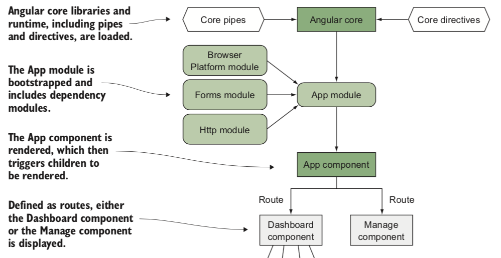

-   Modules are buckets for storing related entities for easy reuse and distribution.
-   A component is an encapsulated element that maintains its own internal logic for how it desires to render some output.
    -   Encapsulation —Keep component logic isolated
    -   Isolation —Keep component internals hidden
    -   Reusability —Allow component reuse with minimal effort
    -   Event-based —Emit events during the lifecycle of the component
    -   Customizable —Possible to style and extend the component
    -   Declarative —Component used with simple declarative markup
-   Services are a way to reuse functional pieces of JavaScript logic across your application.

Angular renders the base app into the browser
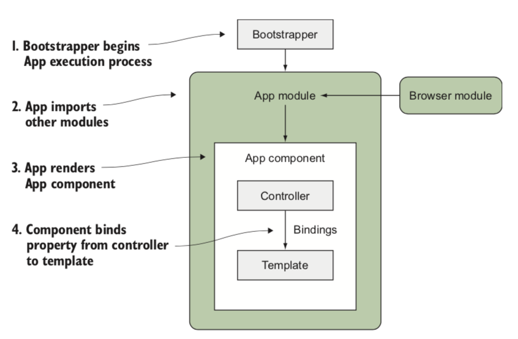

Concepts that compose and influence a component’s behavior
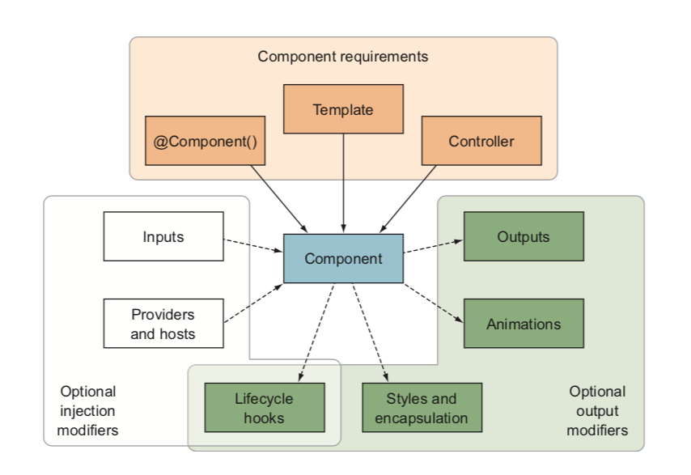

Component lifecycle while the application is running
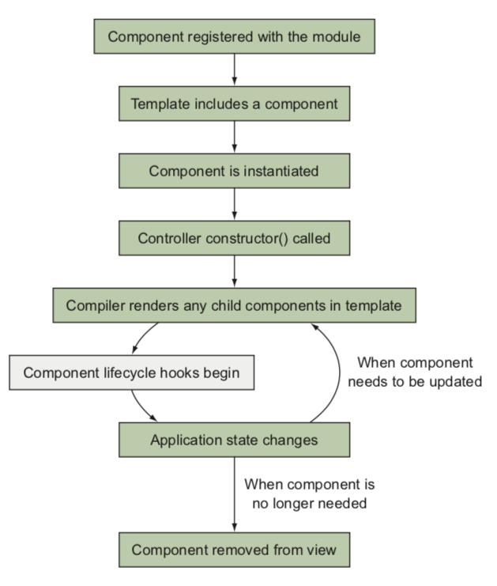

four roles of components:

-   App component —This is the root app component, and you only get one of these per application.
-   Display component —This is a stateless component that reflects the values passed into it, making it highly reusable.
-   Data component —This is a component that helps get data into the application by loading it from external sources.
-   Route component —When using the router, each route will render a component, and this makes the component intrinsically linked to the route.

### App component

-   Keep it simple —If possible, don’t put any logic into the component. Think of it more like a container. It’s easier to reuse and optimize the rest of your components if the App component doesn’t have complex behaviors they depend upon.
-   Use for application layout scaffolding —The template is the primary part of the com- ponent, and you’ll see later in this chapter how we create the primary application layout in this component.
-   Avoid loading data—Usually you will avoid loading data in this component, because I like to load data closer to the component that uses that data. You might load some global data (perhaps something like a user session), though that could also be done separately. On less complex applications, you might load data because it’s more complicated to abstract it on smaller applications.

### Display component

-   Decouple—Ensure that the component has no real coupling to other compo- nents, except that data may be passed into it as an input when requested.
-   Make it only as flexible as necessary—Avoid making these components overly com- plex and adding a lot of configuration and options out of the box. Over time, you might enhance them, but I find it’s best to start simple and add later.
-   Don’t load data —Always accept data through an input binding instead of loading data dynamically through HTTP or through a service.
-   Have a clean API—Accept input bindings to obtain data into the component and emit events for any actions that need to be pushed back up to other components.
-   Optionally use a service for configuration —Sometimes you may need to provide con- figuration defaults, and instead of having to declare the preferences with every use of the component, you can use a service that sets application defaults.

### Data components

Data components are primarily about handling, retrieving, or accepting data.

-   Use appropriate lifecycle hooks —To do the initial data loading, always leverage the best lifecycle hook for when to trigger the loading or persistence of data. We’ll look at this more later in this chapter.
-   Don’t worry about reusability —These components are not likely to be reused because they have a special role to manage data, which is difficult to decouple.
-   Set up display components —Think about how this component can load data needed by other display components and handle any data from user interactions.
-   Isolate business logic inside—This can be a great place to store your application business logic, because anytime you manage data, you’re likely dealing with a specialized implementation that works for a specific use case.

### Route components

-   Template scaffolding for the route —The route will render this component, so this is the most logical place to put the template that’s associated with the route.
-   Load data or rely on data components —Depending on the complexity of your route, the route component may load data for the route or rely on one or more data components to do that for it. If you’re unsure, I’d suggest loading data initially in the Route component and decoupling as your view gets more complex.
-   Handles route parameters—As you navigate, there are likely to be router parameters (such as the ID of the content item being viewed), and this is the best place to handle those parameters, which often determine what content to load from the back end.

## Content projection

Content projection is powerful and quite useful for components that fit the role of display components. As you saw, you can use named or unnamed content insertion points to include markup provided into your component template, all by using the NgContent element.

解决 angular 尝试解析 ng-content 元素编译错误

```ts
// import the NO_ERRORS_SCHEMA object from @angular/core:
import { NgModule, NO_ERRORS_SCHEMA } from '@angular/core';
// Then you’ll add a new property to the NgModule definition called schemas. Add it after the bootstrap property, as you see here:
  bootstrap: [AppComponent],
  schemas: [NO_ERRORS_SCHEMA]
})
```

## change detection mode

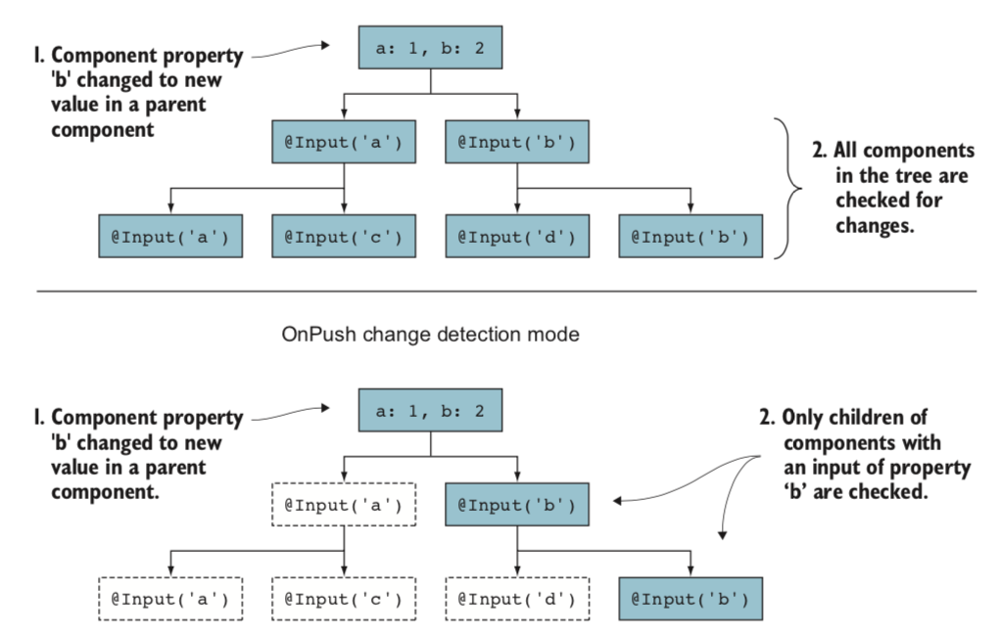

## communicating between components

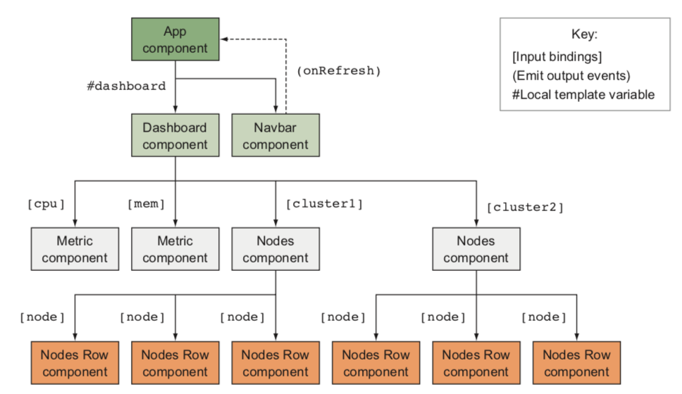

## encapsulation mode

-   none
-   emulated
-   native

### emulated shadow dom encapsulation mode

Emulated mode is the default mode.

## Dynamically creating a component and rendering it

-   ViewContainerRef—This is a reference to an element in the application that Angular understands and that gives us a reference point to where we can render our component.
-   ViewChild—This will give us the ability to reference an element in our con- troller as a ViewContainerRef type, giving us access to APIs needed to render components.
-   ComponentFactoryResolver—An Angular service that gets us the component factory (which is needed to render) for any component that has been added to the entry components list.

```ts
// <ng-template #alertBox></ng-template>

  alertRef: ComponentRef<AlertComponent>;
  @ViewChild('alertBox', {read: ViewContainerRef}) alertBox: ViewContainerRef;

  constructor(private ComponentFactoryResolver: ComponentFactoryResolver) {}

  alert(date) {
    if (!this.alertRef) {
      const alertComponent = this.ComponentFactoryResolver.resolveComponentFactory(AlertComponent);
      this.alertRef = this.alertBox.createComponent(alertComponent);
    }

    this.alertRef.instance.date = date;
    this.alertRef.changeDetectorRef.detectChanges();

    setTimeout(() => this.destroyAlert(), 5000);
  }

  destroyAlert() {
    if (this.alertRef) {
      this.alertRef.destroy();
      delete this.alertRef;
    }
  }
```

# service

Services are fundamentally JavaScript objects that provide commonly used logic in a way that other parts of the application can easily consume.

-   Injectable services
-   Non-injectable
-   Helper
-   Data

## Dependency injection and injector trees

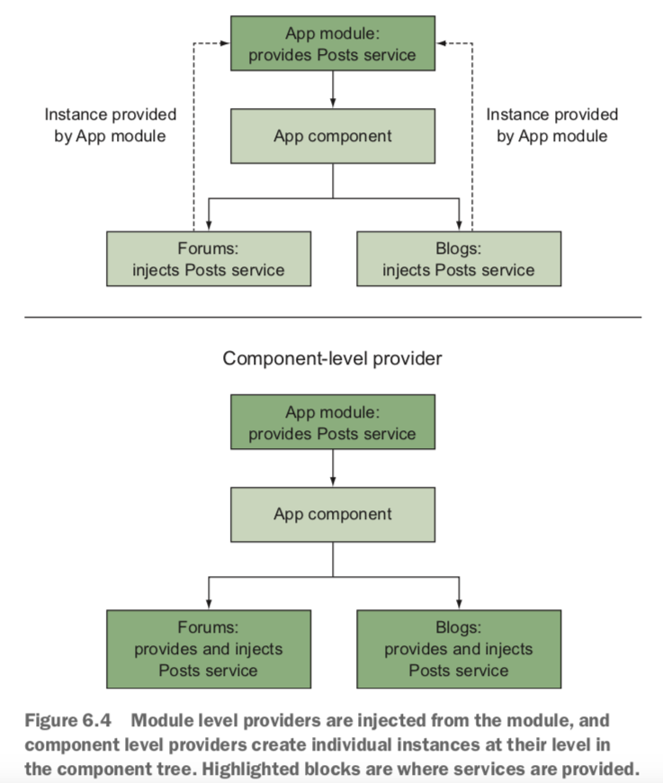

Ways to override a provider with a secondary value or implementation

-   Alias providers: [{provide: PostsService, useExisting: PostsServiceV2}]
-   Class [{provide: PostsService, useClass: PostsServiceV2}]
-   Factory [{provide: PostsService, useFactory: PostsSer- viceFactory, deps: [HttpClient]}]
-   Value [{provide: PostsService, useValue: PostsServiceV2}]

A few tips to keep in mind when it comes to DI and services:

-   Inject at the lowest level
-   Name your services wisely
-   Keep services focused
-   Keep services meaningful
-   Use consistent patterns

## Services without dependency injection

-   ConfigService
-   HttpInterceptor

```ts
@Injectable()
export class StocksInterceptor implements HttpInterceptor {
    constructor(private accountService: AccountService) {}

    intercept(req: HttpRequest<any>, next: HttpHandler): Observable<HttpEvent<any>> {
        const request = req.clone();
        request.headers.append("Accept", "application/json");
        return next.handle(request).do(event => {
            if (event instanceof HttpResponse && event.url === ConfigService.get("api")) {
                const stocks = event.body as Array<Stock>;
                let symbols = this.accountService.stocks.map(stock => stock.symbol);
                stocks.forEach(stock => {
                    this.accountService.stocks.map(item => {
                        if (stock.symbol === item.symbol) {
                            item.price = stock.price;
                            item.change = (stock.price * 100 - item.cost * 100) / 100;
                        }
                    });
                });
                this.accountService.calculateValue();

                return stocks;
            }
        });
    }
}
```

## Helper services

local storage service

```ts
@Injectable()
export class LocalStorageService {
    get(key: string, fallback: any) {
        let value = localStorage.getItem(key);
        return value ? JSON.parse(value) : fallback;
    }

    set(key: string, value: any) {
        localStorage.setItem(key, JSON.stringify(value));
    }
}
```

## Services for sharing

alert service

## Additional services

pipes as services

# routing

## Route properties used in this chapter and their purposes

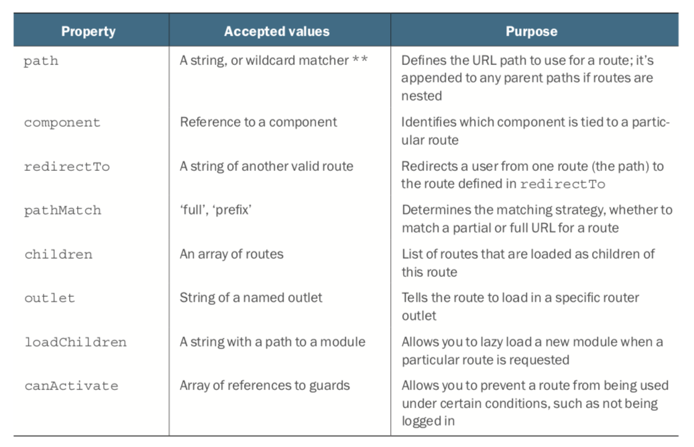

## Feature modules and routing

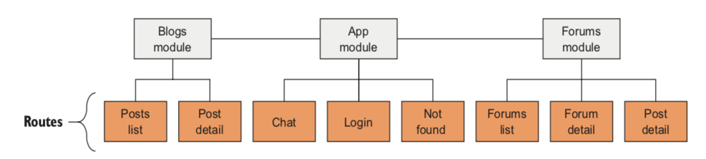

## Secondary routes

named outlet

### Closing a secondary route and programmatic routing

```ts
this.router.navigate（[{outlets：{chat：null}}]）;
```

## Route guards to limit access

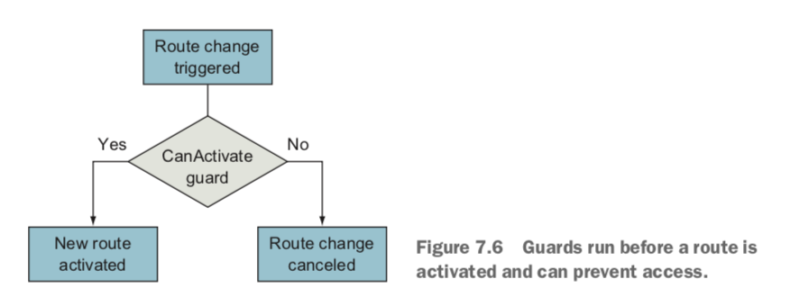

Here are the five types of guards and their basic roles:

-   CanActivate—Used to determine whether the route can be activated (such as user validation)
-   CanActivateChild —Same as CanActivate, but specifically for child routes
-   CanDeactivate —Used to determine whether the current route can be deactivated(such as preventing leaving an unsaved form without confirmation)
-   CanLoad—Used to determine whether the user can navigate to a lazy loaded module prior to loading it
-   Resolve—Used to access route data and pass data to the component’s list of providers

```ts
this.router.navigate(["/login"], {
    queryParams: {
        return: state.url
    }
});
```

## Lazy loading

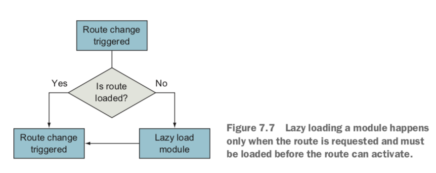

## Routing best practices

best practices

-   Keep URLs short —When possible, URLs should be only as long as they need to be. This can be tricky as your application grows, so being vigilant from the start is the best way to keep on track. There may be some SEO considerations for your URLs, for which I suggest you just keep it simple.
-   Favor path parameters over query variables—The use of query variables should be limited to transient stateful data, such as search filter variables. When you use IDs or resource aliases in the URL, they should almost always be path parameters. Prefer to spell out words —I have a strong preference for not abbreviating variables or paths, because it’s harder to read and some abbreviations are not always clear. Although you should keep URLs short, you shouldn’t shortcut the words you use. Use hyphens when using multiple words —The readability of a URL is important, and if you have multiple words together (like /forums/2-introductions/89-cloned- didactic-knowledge-user), using hyphens between words is the easiest way to read. It’s also easy to parse.
-   Limit the use of secondary routes —As fun as secondary routes can be, they add com- plexity. If a secondary route is contextual to only some of the application routes, then you’d have to keep track of when to enable or disable that secondary route. For example, if you have an application for a bank and there is a secondary route for opening a new account, you would need to pay attention to what the user does and determine when it might be appropriate to close it.
-   Carefully consider the correct guard to use for your use case—There are five types of guards, and sometimes they can be bent to do different tasks. Be aware of the purpose of your guard and use the correct one.
-   Use feature modules so you can use lazy loading—Feature modules are helpful for code isolation, but being able to lazy load modules is extremely useful. It’s much easier to start with feature modules and not use lazy loading than it is to later have to refactor to feature modules to use lazy loading.
-   Keep it simple —This is true of all things, but I think it’s the most important under- lying principle in routing. Things can quickly get out of hand if you have 100 routes when you only needed 10 that had better parameters. Look for ways to simplify all the time!

# building custom directives and pipes

The main reasons apply to both directives and pipes:

-   Reuse and reduce —Instead of each component having to implement similar logic, it can be abstracted out and easily reused. This also reduces code footprint and helps standardize logic.
-   Maintainability and focused components —Components sometimes become a dump- ing ground for code and logic that are tangential to the component itself. Remov- ing that from the component makes it easier to maintain your components.
-   Testability—Moving everything into smaller blocks means you can create smaller test cases and limit permutations.

## Creating an attribute directive

```ts
@Directive({
    selector: "[cardType]"
})
export class CardTypeDirective implements OnInit {
    @Input() cardType;
    @Input() increaseClass = "increase";
    @Input() decreaseClass = "decrease";

    constructor(private el: ElementRef) {}

    ngOnInit() {
        if (this.cardType) {
            if (this.cardType >= 0) {
                this.el.nativeElement.classList.add(this.increaseClass);
                this.el.nativeElement.classList.remove(this.decreaseClass);
            } else if (this.cardType <= 0) {
                this.el.nativeElement.classList.add(this.decreaseClass);
                this.el.nativeElement.classList.remove(this.increaseClass);
            } else {
                this.el.nativeElement.classList.remove(this.increaseClass);
                this.el.nativeElement.classList.remove(this.decreaseClass);
            }
        }
    }
}
```

## Modifying a component with a directive with events

-   @HostListener
-   ...

## Creating a structural directive

`TemplateRef` and `ViewContainerRef` are references to the template of the element our directive is attached to and a reference to the view that contains it, respectively.

```ts
@Directive({
    selector: "[delay]"
})
export class DelayDirective {
    @Input()
    set delay(ms: number) {
        setTimeout(() => {
            this.viewContainer.createEmbeddedView(this.templateRef);
        }, ms);
    }

    constructor(private templateRef: TemplateRef<any>, private viewContainer: ViewContainerRef) {}
}
```

## Crafting custom pipes

There are fundamentally two types of pipes: pure and impure. Pure pipes maintain no state information, and impure pipes maintain state.

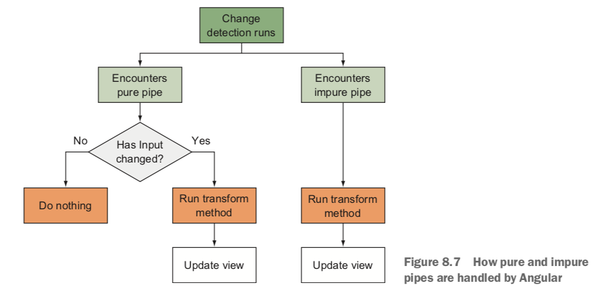

### Creating a pure pipe

```ts
@Pipe({
    name: "change"
})
export class ChangePipe implements PipeTransform {
    constructor(private currencyPipe: CurrencyPipe, private percentPipe: PercentPipe) {}

    transform(stock: StockInterface, showPercent: boolean = true): any {
        let value = `${this.currencyPipe.transform(stock.change, "USD", "symbol", ".2")}`;
        if (showPercent) {
            value += ` (${this.percentPipe.transform(stock.changeInPercent, ".2")})`;
        }
        return value;
    }
}
```

### Creating an impure pipe

```ts
@Pipe({
    name: "changeDetector",
    pure: false
})
export class ChangeDetectorPipe implements PipeTransform {
    count: number = 0;

    transform(value: any, args?: any): any {
        this.count++;
        console.log(`Component change detection executed ${this.count} times`);
        return value;
    }
}
```

```ts
@Pipe({
    name: "news",
    pure: false
})
export class NewsPipe implements PipeTransform {
    cachedSource: string = "";
    news: string = "loading...";

    constructor(private service: StocksService) {}

    transform(source: string, args?: any): any {
        if (source !== this.cachedSource) {
            this.cachedSource = source;

            this.service.getNewsSnapshot(source).subscribe(news => {
                this.news = `<a href="${news.url}" target="_blank">${news.title}</a>`;
            });
        }

        return this.news;
    }
}
```
